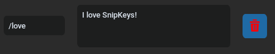

# SnipKeys

`Snipkeys` is a beatiful shortcut application for linux (X11) <br>
It's made using c++ for "backend" and python for "frontend" <br>
It's easy to use and it's pretty fast, works on almost every major linux distro with X window system. <br>
Unfortunately there's no support for Wayland. <br>
### Why is it made?
Because almost all shortcut apps are paid and they're chrome extensions. <br>
- This app is free
- Nice looking and clean (*well I think so*)
- It's working across the system (*not only in browser*)  


## Installation
To install you need to run a few commands
```
git clone https://github.com/imexhausted/snipkeys-gui
cd snipkeys-gui
chmod +x install.sh
./install.sh
```

## Usage
### Shortcuts
As we use SnipKeys for shortcuts we have a few predefined<br>
Shortcut consist of trigger `/love` and value `I love SnipKeys` <br>

<br><br>
Trigger is used to invoke a shortcut so you just need to type `/love` to get `I love SnipKeys` on your screen.
This works in almost any desktop application which has a text field.

---

### Editing/Adding shortcuts
To add a new shprtcut just click on `Add new`
 <br>
To edit a shortcut you can just click on `trigger` or `value` field and type anything you want.
 <br>
Also you need to know that SnipKeys doesnt support new lines `\n` and `=` for now. <br>
Those symbols are just removed when you save shortcut.
 

---

### Delete a shortcut
To delete a shortcut you need to click on trash bin.


---

### Save new shortcut

Finally to save a brand new shortcut you need to click `Save` <br>


---

### Start/Stop Switch

Now when you have a new shortcuts added you can start using them<br>
`Start` button will make backend side of SnipKeys work in a background. <br>
  <br>
While button is red and says `Stop` you can simply close the window and shortcuts will work without window opened. <br>
To stop application you can just click `Stop`. 

---

## Deinstllation
To remove application run:
```
~/.snipkeys/uninstall.sh
```

## Known bugs
On some minor linux distros there could be a problem with X. <br>
For example you may notice that when you use `Ubuntu Budgie` <br>
`Start` button just has no any effect and shrtcuts just don't work at all. <br>
To quickly solve such a problem you can `sudo reboot` to reboot the system. <br>
This will also restart X and SnipKeys will work just fine.

## Source code
If you're interrested in modifying source code of the backend you can go to [this](https://github.com/imexhausted/snipkeys-gui) repo. <br>
To make a new backend work you just need to replace an old `snipkeys` with a new one in the installation folder. 